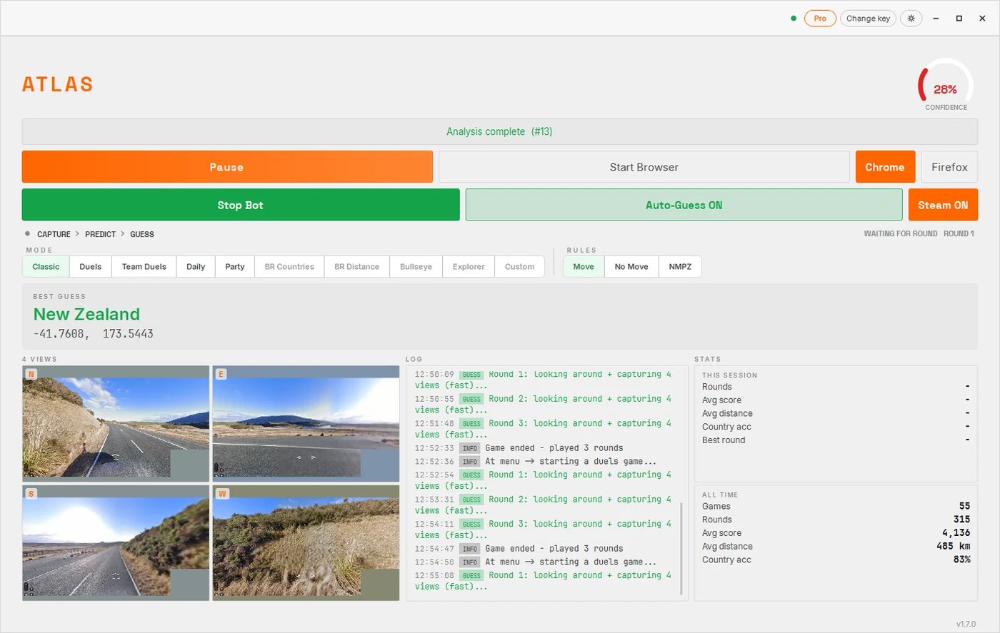

# ATLAS and the Steam edition of GeoGuessr

GeoGuessr on Steam is not the website in a frame. It is its own client, and tools
built for a browser tab tend to do nothing at all in front of it. That is why this
gets its own page instead of a line in a feature list.

ATLAS plays it. Same Windows app, same licence key, no separate purchase.

Pricing: **[geoguessrcheats.com/plans](https://geoguessrcheats.com/plans)**
Where it sits among the others: **[geoguessrcheats.com/platforms](https://geoguessrcheats.com/platforms)**

---

## Arrived in v1.6

Before that release, a Steam player was out of luck. Since then the desktop app
treats the Steam client as just another place to play: it reads the round, works
out the location, drops the pin and carries on to the next one, unattended, the
same way it does in a browser.

All three movement rulesets are covered. Move, No Move, and NMPZ.

## What you need

- A Windows machine. Windows 10 or 11, 64 bit.
- GeoGuessr installed through Steam.
- The ATLAS desktop app.
- A licence key. If you already bought one for the extension or your phone, it
  covers this too.

## The one restriction worth stating plainly

Windows only.

Not because we did not get round to a Mac build of ATLAS, but because the Steam
edition of GeoGuessr has no Mac build to drive. If you are on a Mac, the browser
extension is your route and it is covered in the
[macOS repository](https://github.com/Sven233333/atlas-geoguessr-macos).

## Getting it running

1. Install GeoGuessr from Steam and sign in once.
2. Install ATLAS and paste your key.
3. Turn on Steam mode in the app.
4. Choose your ruleset and start. From here it is hands off.

## Questions

**Do I need a second key for Steam?**
No. One key covers Windows, the browser extension and the phone apps.

**Is the accuracy different on Steam than in a browser?**
No. It is the same prediction on the same street view. The published figure is 81
percent country accuracy in real games across 111 countries, and it is not
measured per client.

**Can it play Duels on Steam?**
The Steam client offers what it offers. Whatever mode you can open there, ATLAS
plays it under all three movement rules.

**Does it work with the Steam overlay open?**
Close it while playing. There is no reason to have it in the way.

**What if I own GeoGuessr on the website instead?**
Then use the browser route or the desktop app against the website. See
[atlas-geoguessr-windows-app](https://github.com/Sven233333/atlas-geoguessr-windows-app).

## Related repositories

The complete picture is in
[Atlas-geoguessr-bot](https://github.com/Sven233333/Atlas-geoguessr-bot). The app
that does the work here is documented in
[atlas-geoguessr-windows-app](https://github.com/Sven233333/atlas-geoguessr-windows-app).

## Disclaimer

Independent project, no affiliation with GeoGuessr AB or with Valve. Using an
assistant may be against the rules of a game or a competition. That is your call
to make.
